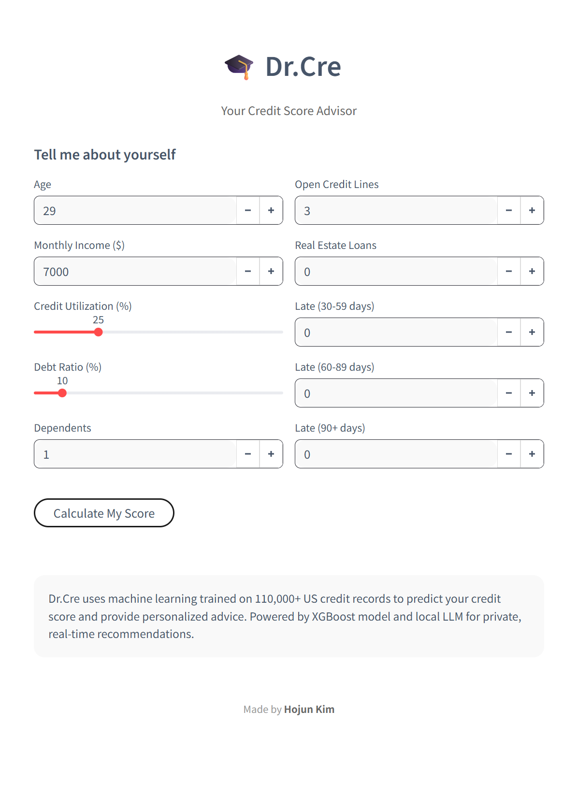
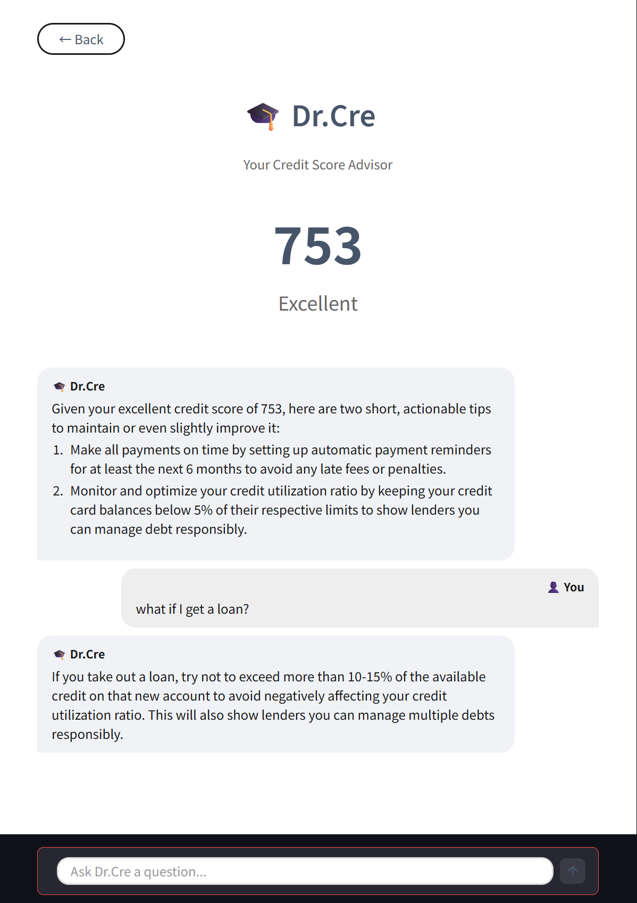

# 🎓 Dr.Cre - AI-Powered Credit Score Advisor

> Credit score prediction combining machine learning with conversational AI for personalized financial guidance.

[](https://www.python.org/)
[](https://streamlit.io/)

## Overview

Dr.Cre predicts credit scores (300-850) using XGBoost trained on 110K+ records and provides personalized advice through an LLM-powered chatbot. Enter your financial info, get instant results, and chat for improvement tips.

## Why I Built This

Most credit score services give you a number without explaining why or how to improve. I built Dr.Cre to be different: a transparent advisor that predicts your score and teaches you how to build better credit through personalized AI guidance.

**Key Features:**
- Credit score prediction trained on 110K+ real credit records
- Interactive chat with streaming AI responses for personalized tips
- Privacy-first: runs entirely on your local machine

## Tech Stack

**Machine Learning**
- XGBoost for credit score prediction
- scikit-learn for preprocessing
- pandas for data manipulation

**AI & LLM**
- Ollama + Llama 3.1 (8B) for conversational advice
- Streaming API for real-time responses

**Frontend**
- Streamlit web framework
- Custom CSS for UI design

## Model Performance

**Dataset:** Kaggle "Give Me Some Credit" (150K → 111K after cleaning)

**Metrics:**
- Recall (catching defaults): 73%
- Overall accuracy: 79%
- Training split: 80/20 (89K train / 22K test)

**Why prioritize recall?** For a credit advisor, catching potential issues is more important than avoiding false alarms.

## How It Works

1. **Input** → 10 financial metrics (age, income, debt ratio, etc.)
2. **Predict** → XGBoost calculates default risk → credit score (300-850)
3. **Advise** → Llama 3.1 generates personalized tips
4. **Chat** → Ask follow-up questions with context awareness

**Score Formula:** `850 - (default_probability × 550)`

## Screenshots

### Input Page

*User-friendly form for entering financial information*

### Results & Chat Interface

*Credit score display with real-time streaming AI advice*

## Installation & Setup

### Prerequisites
- Python 3.13+
- [Ollama](https://ollama.ai/) installed
- ~5GB disk space for Llama 3.1

### Quick Start
```bash
# 1. Clone repository
git clone https://github.com/yourusername/dr-cre.git
cd dr-cre

# 2. Setup virtual environment
python -m venv venv
venv\Scripts\activate  # Windows
# source venv/bin/activate  # Mac/Linux

# 3. Install dependencies
pip install -r requirements.txt

# 4. Download LLM model
ollama pull llama3.1

# 5. Start Ollama (separate terminal)
ollama serve

# 6. Run application
streamlit run app/app.py
```

Visit `http://localhost:8501` in your browser.

## Project Structure
```
dr-cre/
├── app/
│   └── app.py              # Streamlit UI with streaming chat
├── src/
│   ├── score.py            # XGBoost prediction logic
│   └── advisor.py          # LLM streaming functions
├── models/
│   └── credit_model.pkl    # Trained model
├── notebooks/
│   ├── 01_data_exploration.ipynb
│   ├── 02_model_training.ipynb
│   └── 03_ollama_test.ipynb
├── data/processed/
│   └── credit_cleaned.csv
└── requirements.txt
```

## Technical Highlights

**Data Pipeline:** Cleaned 150K → 111K records by removing outliers and handling missing values

**Model:** XGBoost with class imbalance handling (scale_pos_weight=16), prioritizing recall for safety

**UI/UX:** Streaming LLM responses with real-time indicators for smooth chat experience

## License

CC BY-NC 4.0 - see [LICENSE](LICENSE) file for details.

## Author

**[kimh.july@gmail.com]**  

## Acknowledgments

- Dataset: [Kaggle "Give Me Some Credit"](https://www.kaggle.com/c/GiveMeSomeCredit)
- LLM: Meta's Llama 3.1 via Ollama

---

**Note:** Educational project for portfolio demonstration. Not intended for actual financial decisions. Consult licensed professionals for real financial advice.